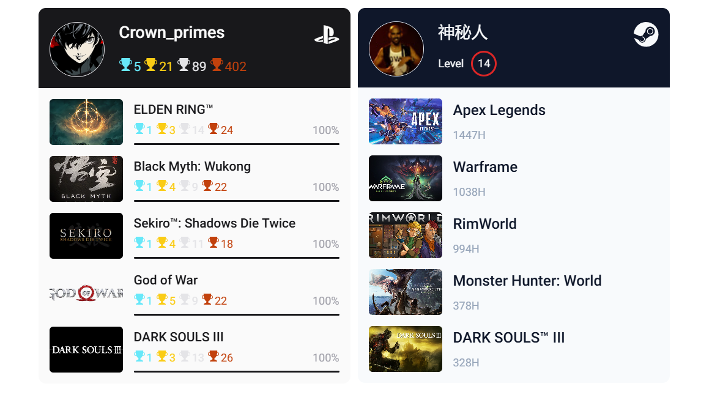

# @july_cm/react-game-profile

显示 PlayStation 或 Steam 账号档案的 React 组件，在我的[个人网站](https://www.july.icu/abort)用到。



## 功能 | features

- 支持 RSC（推荐）；

- 支持 PlayStation 和 Steam 账号的用户档案；

- 使用 css 变量可便捷的覆写样式；

- 支持按需加载、Typescript 友好、ESM 版本。

## PsnProfile

`PsnProfile` 底层使用 [psn-api](https://github.com/achievements-app/psn-api) 封装的接口库，但无论如何你在使用前都需要获取 PSN 账号的 `npsso`。步骤如下：

1. 使用浏览器访问 [https://www.playstation.com/](https://www.playstation.com/)，并完成账号登陆

2. 保持 Cookie 存活的情况下，访问 [https://ca.account.sony.com/api/v1/ssocookie](https://ca.account.sony.com/api/v1/ssocookie)。你会看到一个 JSON 格式的字符串返回：

```json
{ "npsso": "<64 character token>" }
```

它就是当前 PSN 账号的 npsso，这意味着后续所有的数据请求都将已此账号的身份进行。同时注意请不要把它暴露在任何公共位置（不要直接写在客户端运行的代码中）。

更多信息也可以参考 [psn-api doc](https://psn-api.achievements.app/)。

组件的使用非常简单：

```tsx
import { PsnProfile } from '@july_cm/react-game-profile/psn';
// 默认样式，可选导入
import "@july_cm/react-game-profile/psn/psn.css";

export const App = () => <PsnProfile npsso={npsso} />
```

**特别注意，以上代码无法直接运行在浏览器环境！！！**，原因如下：

1. npsso 密钥不适合直接暴露在客户端环境；

2. psn 的 api 不支持跨域，无法从浏览器直接发起 http 请求。

这也是本包推荐 RSC 的主要原因。

如果你拥有独立的 node 服务端和客户端环境，那么也可以分离数据与渲染（不推荐）：

```tsx
// 服务端
import { generatePsnProfile } from '@july_cm/react-game-profile/psn';

app.get("/psn-profile", async (_, res) => {
  const data = await generatePsnProfile(process.env.PSN_NPSSO);
  res.json(data);
})

// 客户端
import { PsnProfileUI } from '@july_cm/react-game-profile/psn';

export const App = () => {
  const [profile] = useState();
  return <PsnProfileUI profile={profile} />
}
```

上述使用方式并不会得到我的主要支持，也许在未来会被废弃也不一定。

## SteamProfile

`SteamProfile` 底层的 [steamwebapi-ts](https://github.com/Pho3niX90/steamwebapi-ts) 是对 [Steam Web API](https://partner.steamgames.com/doc/webapi) 的封装。

使用该组件必须获得 **apiKey** 和 **steamId** 两个常量值：

1. 前往 [https://steamcommunity.com/dev/apikey](https://steamcommunity.com/dev/apikey) 登录 Steam 账号并申请一个 apiKey。

2. 前往 Steam 网页的账号主页，URL 中的 int64 数字即为 steamId

```
https://steamcommunity.com/profiles/76561******134369/
```

其中 apiKey 请私密保管，steamId 是可公开数据。组件使用方式如下：

```tsx
import { SteamProfile } from '@july_cm/react-game-profile/steam';
// 默认样式，可选导入
import "@july_cm/react-game-profile/steam/steam.css";

export const App = () => <SteamProfile apiKey={apiKey} steamId={steamId} />
```

*关于运行环境的问题同 PsnProfile，这里不再赘述。*

## 自定义样式

在组件设计上 PsnProfile、SteamProfile 都是独立打包，用于独立的样式名称和样式表，所以样式调整非常灵活。

本包自带的样式表色值主要参考 [tailwind](https://www.shadcn-ui.cn/colors) 的调色盘，如果需要做样式覆盖也非常简单，只需要覆盖对应色织的 css 变量即可，这里罗列所用到的 css 变量：

### psn

```css
--psn-zinc-50: 0 0% 98%;
--psn-zinc-200: 240 5.9% 90%;
--psn-zinc-400: 240 5% 64.9%;
--psn-zinc-800: 240 3.7% 15.9%;
--psn-zinc-900: 240 5.9% 10%;

--psn-cyan-300: 187 92.4% 69%;
--psn-yellow-400: 47.9 95.8% 53.1%;
--psn-orange-700: 17.5 88.3% 40.4%;

--psn-foreground-plus: var(--psn-zinc-900);
--psn-foreground-primary: var(--psn-zinc-800);
--psn-foreground-secondary: var(--psn-zinc-400);
--psn-foreground-inverse: var(--psn-zinc-50);

--psn-background: var(--psn-zinc-50);
--psn-background-primary: var(--psn-zinc-900);
--psn-background-secondary: var(--psn-zinc-200);

/* trophy color */
--psn-platinum: var(--psn-cyan-300);
--psn-gold: var(--psn-yellow-400);
--psn-silver: var(--psn-zinc-200);
--psn-bronze: var(--psn-orange-700);
```

### steam

```css
--steam-slate-50: 210 40% 98%;
--steam-slate-200: 214.3 31.8% 91.4%;
--steam-slate-400: 215 20.2% 65.1%;
--steam-slate-800: 217.2 32.6% 17.5%;
--steam-slate-900: 222.2 47.4% 11.2%;

--steam-red-600: 0 72.2% 50.6%;

--steam-foreground-plus: var(--steam-slate-900);
--steam-foreground-primary: var(--steam-slate-800);
--steam-foreground-secondary: var(--steam-slate-400);
--steam-foreground-inverse: var(--steam-slate-50);

--steam-background: var(--steam-slate-50);
--steam-background-primary: var(--steam-slate-900);
--steam-background-secondary: var(--steam-slate-200);

--steam-level-border: var(--steam-red-600);
```